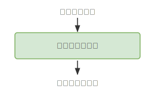

# 2章 引数と戻り値

## 基礎知識

### メソッドとは

**メソッド**とは、処理をひとまとめにして名前をつけたものです。一度定義しておけば、名前を書くだけで何度でも同じ処理を実行できます。

メソッドは「自動販売機」に例えると理解しやすいです。



- 自動販売機にお金とボタンを押す → 飲み物が出てくる
- メソッドに値を渡す（引数）     → 結果が返ってくる（戻り値）

C# では `戻り値の型 メソッド名()` と書き、`return` で値を返します。

```csharp
static string Greet()
{
    return "こんにちは！";
}

Console.WriteLine(Greet());  // → こんにちは！
```

---

### 戻り値とは

**戻り値**とは、メソッドが処理を終えた後に呼び出し元に返す値です。`return` に続けて返したい値や式を書きます。

```csharp
static int Add()
{
    return 3 + 5;  // 計算結果の 8 を返す
}

int result = Add();      // result に 8 が入る
Console.WriteLine(result);  // → 8
```

戻り値があるメソッドは、式の中でそのまま使えます。

```csharp
Console.WriteLine(Add() * 2);  // → 16（8 × 2）
```

戻り値の型は先頭の型名で指定します。`string` を返すなら `static string`、`int` を返すなら `static int` と書きます。値を返さないメソッドは `void` を使います。

---

### メソッドに値を渡す（引数）

引数なしのメソッドは毎回同じ結果しか返せません。**引数**を使うと、渡す値によって結果を変えられます。

```csharp
static int Double(int x)
{
    return x * 2;
}

Console.WriteLine(Double(5));  // → 10
Console.WriteLine(Double(3));  // → 6
```

引数は `型名 変数名` の形で定義します。メソッドを呼び出すときは `メソッド名(値)` と書きます。

引数を変えるだけで同じメソッドを何度でも使いまわせます。

---

### 引数を複数定義する

カンマ区切りで複数の引数を定義できます。

```csharp
static int Sum(int x, int y)
{
    return x + y;
}

Console.WriteLine(Sum(3, 7));   // → 10
Console.WriteLine(Sum(10, 20)); // → 30
```

呼び出す側も同じ順番・個数で値を渡す必要があります。順番が違うと意図しない結果になるので注意しましょう。

---

### 引数の型

引数にも変数と同様に型を指定します。型が合わない値を渡すとエラーになります。

| 型 | 渡せる値の例 |
|---|---|
| `int` | `10`, `-5`, `0` |
| `double` | `3.14`, `0.5` |
| `string` | `"hello"`, `"C#"` |

---

### 複数の値を返す（文字列補間）

C# のメソッドは値を 1 つしか返せません。複数の計算結果をまとめて返したいときは、カンマ区切りの文字列にまとめる方法が便利です。

```csharp
static string Powers(int x)
{
    return $"{x},{x * x},{x * x * x}";
}

Console.WriteLine(Powers(2));  // → 2,4,8
Console.WriteLine(Powers(3));  // → 3,9,27
```

`$"..."` は文字列補間で、`{式}` の部分が計算結果に置き換わります（1章で学習済み）。

---

## 練習問題

### 問題 2-1

`string` 型の引数 `s` を受け取り、`s` をそのまま返す関数を実装しなさい。

---

### 問題 2-2

`int` 型の引数 `x` を受け取り、`x` をそのまま返す関数を実装しなさい。

---

### 問題 2-3

`int` 型の引数 `x` を受け取り、`x` を **2 倍・3 倍・4 倍** した結果をカンマ区切りの文字列で返す関数を実装しなさい。

例: `x = 3` のとき `"6,9,12"` を返す

---

### 問題 2-4

`int` 型の引数 `x` を受け取り、`x` の **1 乗・2 乗・3 乗** をカンマ区切りの文字列で返す関数を実装しなさい。

例: `x = 2` のとき `"2,4,8"` を返す

**ヒント:** 累乗は `Math.Pow(x, 2)` または `x * x` を使います。整数で返したい場合は `(int)Math.Pow(x, 2)` のようにキャストします。

> **注意:** `Math.Pow` は戻り値が `double` 型です。`int` として使う場合は `(int)` キャストを忘れないようにしましょう。なお、2乗・3乗程度であれば `x * x` や `x * x * x` のように掛け算で書く方がシンプルです。

---

### 問題 2-5

`int` 型の引数 `x`、`y` を受け取り、以下の計算結果をそれぞれ返す関数を実装しなさい。

| 関数名 | 内容 | 戻り値の型 |
|---|---|---|
| `Problem2_5_Sum` | x と y の和 | `int` |
| `Problem2_5_Difference` | x と y の差（x − y） | `int` |
| `Problem2_5_Product` | x と y の積 | `int` |
| `Problem2_5_Division` | x ÷ y の結果（小数あり） | `double` |
| `Problem2_5_Quotient` | x ÷ y の商（整数） | `int` |
| `Problem2_5_Remainder` | x ÷ y の余り | `int` |

**ヒント:** 小数ありの除算は `(double)x / y`、整数の商は `x / y`、余りは `x % y` を使います。

---

### 問題 2-6

`int` 型の引数 `a`、`b` を受け取り、2 つの整数の平均値（整数）を返す関数を実装しなさい。

※ 小数点以下は切り捨ててよい。

**ヒント:** `int` 同士の `(a + b) / 2` は自動的に切り捨てになります。

---

### 問題 2-7

`int` 型の引数 `age`（年齢）を受け取り、生まれてからのおおよその日数を返す関数を実装しなさい。

※ 閏年は考慮せず、`年齢 × 365` で計算する。

---

### 問題 2-8

2 つの `int` 型引数 `x`、`y`（`x` > `y`）を受け取り、`x ÷ y` の **商と余り** をカンマ区切りの文字列で返す関数を実装しなさい。

例: `x = 10, y = 3` のとき `"3,1"` を返す（商 3、余り 1）

**ヒント:** `int` 同士の `/` が商、`%` が余りです。
